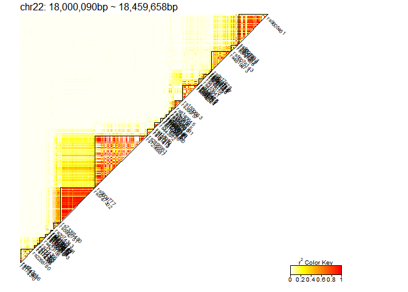
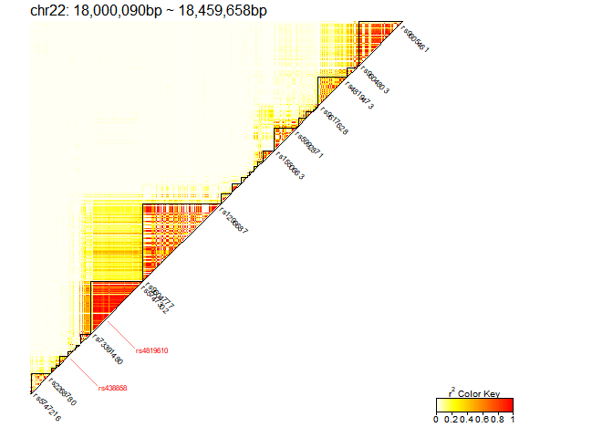

Big-LD: A new haplotype block detection method
================
Sunah Kim (<sunny03@snu.ac.kr>)

Big-LD
======

Big-LD is a block partition method based on interval graph modeling of LD bins which are clusters of strong pairwise LD SNPs, not necessarily physically consecutive. The detailed information about the Big-LD can be found in our paper published in [bioinformatics](https://academic.oup.com/bioinformatics/article/doi/10.1093/bioinformatics/btx609/4282661/A-new-haplotype-block-detection-method-for-dense).

Installation
------------

``` r
library("devtools")
devtools::install_github("sunnyeesl/BigLD")
```

``` r
library(BigLD)
```

Data
----

You need an additive genotype data (each SNP genotype is coded in terms of the number of minor alleles) and a SNP information data. The package include sample genotype data and SNPinfo data.

Load the sample data (if you installed the BigLD packages).

``` r
data(geno)
data(SNPinfo)
```

Or simply you can download the sample data from `/inst/extdata` The sample data include 1000SNPs and 286 individuals.

``` r
geno[1:10, 1:7]
```

    ##    rs174309 rs174310 rs5747216 rs174312 rs174313 rs5747217 rs174314
    ## 1         0        0         0        0        0         0        0
    ## 2         1        1         0        0        1         1        1
    ## 3         0        0         0        0        0         0        0
    ## 4         1        1         0        0        1         1        1
    ## 5         1        1         0        0        1         1        1
    ## 6         2        2         0        0        2         2        2
    ## 7         2        2         0        1        2         1        2
    ## 8         0        0         1        0        0         0        0
    ## 9         0        0         0        0        0         0        0
    ## 10        1        1         1        0        1         1        1

``` r
head(SNPinfo)
```

    ##        rsID       bp
    ## 1  rs174309 18000090
    ## 2  rs174310 18000280
    ## 3 rs5747216 18000829
    ## 4  rs174312 18001109
    ## 5  rs174313 18001375
    ## 6 rs5747217 18001894

CLQD
----

`CLQD` partitioning the SNPs into subgroups such that each subgroup contains highly correlated SNPs. There are two CLQ methods, original CLQ(`ClQmode = 'Maximal'`) and CLQD (`ClQmode = 'Density'`).

``` r
CLQres = CLQD(geno, SNPinfo, CLQmode = 'Density')
```

``` r
head(CLQres, n = 40)
```

    ##  [1]  25  25 106  57  25  81  25  25  57  57  15  15  15  81  57  26  26
    ## [18]  26  81  57  88  88  NA  88  88  81  88  81  81  91  81  81 106  81
    ## [35]  91  81  81  88  81  91

Big\_LD
-------

`Big\_LD\` returns the estimation of LD block regions of given data.

``` r
BigLDres = Big_LD(geno, SNPinfo)
```

    ## [1] "split whole sequence into subsegments"
    ## [1] "cutting sequence, done"
    ## [1] "there is only one sub-region!"
    ## [1] "end pre-steps"
    ## [1] "CLQ done!"
    ## [1] 1 1
    ## [1] "2017-10-19 17:29:47 KST"

``` r
BigLDres
```

    ##    start  end  start.rsID    end.rsID start.bp   end.bp
    ## 1      1    2    rs174309    rs174310 18000090 18000280
    ## 2      3   54   rs5747216   rs2268780 18000829 18031530
    ## 3     58   69    rs174346    rs174358 18036253 18043090
    ## 4     70   77    rs174360    rs174365 18044257 18045084
    ## 5     78  101    rs174366    rs423158 18046680 18053496
    ## 6    102  113   rs1296810 rs148048073 18054369 18057141
    ## 7    114  116  rs75599514  rs77113684 18057200 18057362
    ## 8    119  120  rs60773453  rs74276474 18057926 18057936
    ## 9    121  123  rs74196725  rs12484668 18059204 18060356
    ## 10   124  132 rs185617591   rs4819604 18060385 18060457
    ## 11   136  161   rs2074343   rs5992751 18065981 18080154
    ## 12   162  302  rs73391480   rs5747302 18080431 18118204
    ## 13   303  512   rs9604777   rs1296687 18118636 18231046
    ## 14   513  538   rs2895951    rs181413 18232368 18239312
    ## 15   539  540    rs181414    rs181415 18240212 18240260
    ## 16   543  566    rs415050    rs443912 18242182 18257138
    ## 17   567  581   rs8190256 rs116984560 18258344 18263834
    ## 18   583  584   rs5992838   rs1076489 18264831 18265172
    ## 19   585  587   rs9617618  rs12165723 18265271 18266989
    ## 20   588  596  rs73380798  rs79268089 18267982 18271491
    ## 21   599  600    rs382013    rs429357 18276101 18277314
    ## 22   602  611 rs117306911   rs5992105 18278320 18283247
    ## 23   612  624   rs7291975    rs389496 18283876 18289204
    ## 24   625  653   rs8140645    rs399757 18289555 18295575
    ## 25   654  715   rs1550663   rs5992871 18296238 18310110
    ## 26   716  717   rs5992872   rs5992121 18310363 18310367
    ## 27   719  720   rs7287465   rs5992122 18311845 18312343
    ## 28   721  741   rs8136428    rs453841 18313018 18317821
    ## 29   742  758    rs415170    rs748779 18318963 18325067
    ## 30   760  764   rs2587111   rs2587113 18326754 18328503
    ## 31   765  766   rs2587114   rs2111546 18329146 18329411
    ## 32   767  772   rs9618143  rs10427597 18329571 18332410
    ## 33   774  851   rs9617628   rs4819473 18333467 18380081
    ## 34   852  877  rs56076143   rs5747406 18380917 18395952
    ## 35   879  882   rs5747408   rs9604802 18397120 18398018
    ## 36   883 1000   rs9604803   rs9605461 18398207 18459658

If you want to apply heuristic procedure, add option `checkLargest = TRUE`.

``` r
Big_LD(geno, SNPinfo, MAFcut = 0.05, checkLargest = TRUE, appendrare = TRUE)
```

LDblockHeatmap
--------------

`LDblockHeatmap` visualize the LDblock boundaries detected by Big\_LD.

You can input the results obtained using Big-LD (`LDblockResult= BigLDres`). If you do not input a Big-LD results, the `LDblockHeatmap` function first excute `Big_LD` function to obtain an LD block estimation result.

``` r
LDblockHeatmap(geno, SNPinfo, 22, LDblockResult= BigLDres)
```



You can show the location of the specific SNPs (`showSNPs = SNPinfo[c(100, 200), ]` shows the 100th and 200th SNPs), or give the threshold for LD block sizes to show SNP information (`showLDsize = 50`). If you want to save the LD heatmap results as tif file, add options such as `savefile = TRUE, filename = "LDheatmap2.tif"`.

``` r
LDblockHeatmap(geno, SNPinfo, 22, showSNPs = SNPinfo[c(100, 200), ], showLDsize = 50, savefile = TRUE, filename = "LDheatmap2.tif")
```



If you have any suggestion or question, please contact us (<sunny03@snu.ac.kr>).
